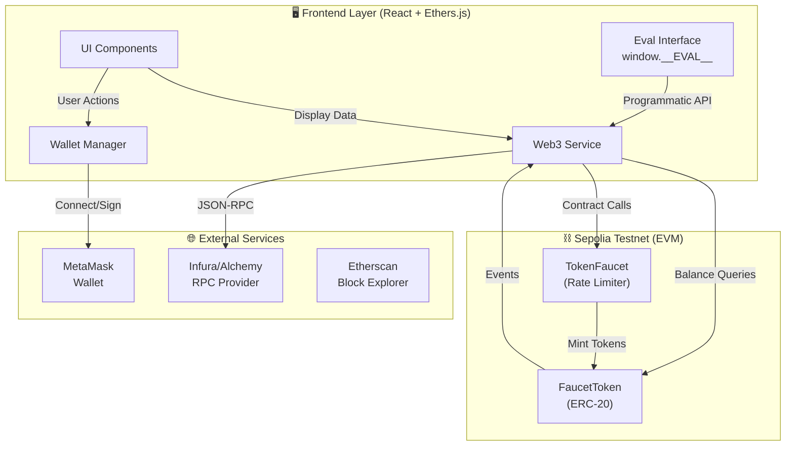
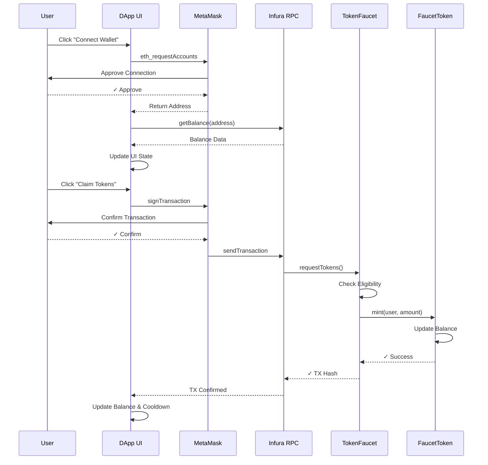
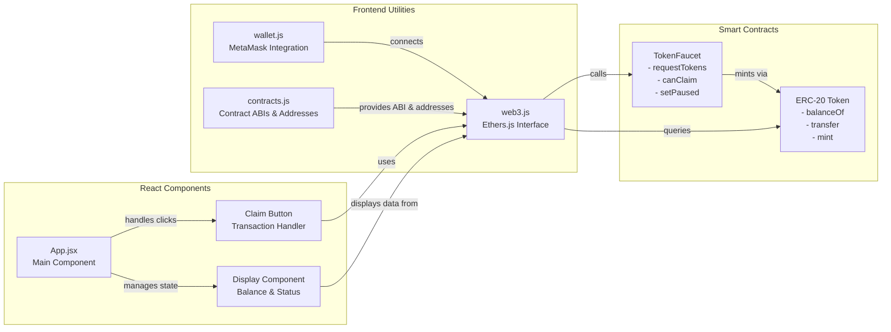

# 🚰 ERC-20 Token Faucet DApp

A full-stack decentralized application (DApp) that distributes ERC-20 tokens with enforced rate limiting on the Sepolia testnet. Built with Solidity, Hardhat, React, and Docker.


## 📋 Table of Contents

- [Overview](#overview)
- [Features](#features)
- [Architecture](#architecture)
- [Deployed Contracts](#deployed-contracts)
- [Screenshots](#screenshots)
- [Video Demonstration](#video-demonstration)
- [Quick Start](#quick-start)
- [Smart Contracts](#smart-contracts)
- [Configuration](#configuration)
- [Testing](#testing)
- [Deployment Verification](#deployment-verification)
- [Design Decisions](#design-decisions)
- [Security Considerations](#security-considerations)
- [Evaluation Interface](#evaluation-interface)
- [Known Limitations](#known-limitations)
- [License](#license)

## 🎯 Overview

This DApp implements a token distribution system (faucet) with on-chain access control and rate limiting. Users can claim free ERC-20 tokens on the Sepolia testnet, subject to:

- **24-hour cooldown period** between consecutive claims
- **Lifetime limit** of 100 tokens per Ethereum address
- **Pause functionality** for emergency stops (admin only)

The project demonstrates production-ready Web3 development practices including smart contract security, frontend wallet integration, comprehensive testing, and full containerization.

## ✨ Features

### Smart Contract Features

- ✅ Fully ERC-20 compliant token implementation
- ✅ Fixed maximum supply (100 million tokens)
- ✅ Rate limiting with 24-hour cooldown
- ✅ Lifetime claim limits per address
- ✅ Pause/unpause functionality
- ✅ Reentrancy protection
- ✅ Gas-optimized storage
- ✅ Comprehensive event emissions

### Frontend Features

- ✅ MetaMask wallet integration
- ✅ Real-time balance updates
- ✅ Cooldown timer with countdown
- ✅ Responsive UI with error handling
- ✅ Transaction status tracking
- ✅ Network detection and switching
- ✅ Evaluation interface (`window.__EVAL__`)

### DevOps Features

- ✅ Fully Dockerized application
- ✅ Health check endpoint
- ✅ Environment-based configuration
- ✅ Automated deployment scripts
- ✅ Contract verification on Etherscan

## 🏗️ Architecture

### System Architecture Diagram



### User Flow Diagram



### Component Interaction Diagram



## 📜 Smart Contracts

### Token.sol

ERC-20 token implementation with controlled minting.

**Key Properties:**

- Name: "Faucet Token"
- Symbol: "FCT"
- Decimals: 18
- Max Supply: 100,000,000 FCT

**Functions:**

- `mint(address to, uint256 amount)` - Mints tokens (faucet only)
- `setMinter(address _minter)` - Sets authorized minter (owner only)

### TokenFaucet.sol

Token distribution contract with rate limiting.

**Key Properties:**

- Faucet Amount: 10 FCT per claim
- Cooldown: 24 hours (86,400 seconds)
- Lifetime Limit: 100 FCT per address

**Functions:**

- `requestTokens()` - Claims tokens (public)
- `canClaim(address user)` - Check eligibility (view)
- `remainingAllowance(address user)` - Get remaining claimable amount (view)
- `timeUntilNextClaim(address user)` - Get cooldown time (view)
- `setPaused(bool _paused)` - Pause/unpause faucet (admin only)

**Events:**

- `TokensClaimed(address indexed user, uint256 amount, uint256 timestamp)`
- `FaucetPaused(bool paused)`

## 🚀 Deployed Contracts

### Sepolia Testnet (Live)

| Contract    | Address                                      | Etherscan Link                                                                                       | Verified |
| ----------- | -------------------------------------------- | ---------------------------------------------------------------------------------------------------- | -------- |
| FaucetToken | `0xC5B2756849181e91f4cBb38eD3bA41a73C6BD99e` | [View on Etherscan](https://sepolia.etherscan.io/address/0xC5B2756849181e91f4cBb38eD3bA41a73C6BD99e) | ✅       |
| TokenFaucet | `0x3717DDA4a942d63f4d9d284E99c2a5B1Fd4F2BD7` | [View on Etherscan](https://sepolia.etherscan.io/address/0x3717DDA4a942d63f4d9d284E99c2a5B1Fd4F2BD7) | ✅       |

**Deployment Details:**

- **Network:** Sepolia (Chain ID: 11155111)
- **Deployment Date:** February 12, 2026
- **Block Number:** 10,244,335
- **Deployer Address:** `0xcbFF4f78627e9988ACFDCB8C82B17de53e5F8a37`

### Contract Verification

Both contracts are fully verified on Etherscan with complete source code visibility:

- Full Solidity source code available for inspection
- Compiler version: 0.8.20
- Optimization enabled (200 runs)
- Constructor arguments properly encoded

You can interact with the contracts directly through the Etherscan interface or use the frontend DApp.

## � Screenshots

### 1. Wallet Connection Interface


**What you see:** DApp landing page with clean interface and "Connect Wallet" button ready.  
**Action:** User clicks button → MetaMask popup appears → User approves connection  
**Result:** Wallet is connected and recognized by the application

---

### 2. Connected Dashboard - Initial State


**Dashboard Shows:**

- Connected Ethereum address
- **Balance: 0 FCT** (initial, no claims yet)
- **Remaining Allowance: 100 FCT** (full lifetime available)
- "Claim Tokens" button: **ENABLED** ✓

---

### 3. Token Balance Display


**After Claim Processed:**

- **Balance: 10 FCT** ✅ (received from claim)
- **Remaining: 90 FCT** (out of 100 lifetime)
- **Cooldown: 23:59:00** (24-hour countdown active)
- "Claim Tokens" button: **DISABLED** (must wait)

---

### 4. Successful Claim Transaction


**Success Details:**

- ✅ Confirmation message displayed
- Transaction hash visible (verifiable on Etherscan)
- Balance updated: **10 FCT**
- Cooldown timer running: **23:59:00**
- Button remains disabled during cooldown

---

### 5. Transaction Confirmation Flow


**Transaction Approval Modal Shows:**

- Network: **Sepolia** (correct testnet)
- From: Your connected wallet
- To: **TokenFaucet** contract address
- Function: `requestTokens()` call
- Gas: Transaction fee estimate
- Tokens: **10 FCT** to be minted
- **Action:** User clicks "Confirm" to approve

After confirmation → Transaction sent → Balance updates → Cooldown activates

### 6. Error States & Edge Cases

The application gracefully handles all error conditions with clear user feedback:

**Cooldown Period Enforcement:**

- When user attempts to claim during 24-hour cooldown
- Displays: "Cooldown period not elapsed. Time remaining: 23h 45m 30s"
- Claim button disabled with countdown timer
- Real-time updates as cooldown progresses

**Lifetime Claim Limit:**

- When user reaches 100 FCT total claimed
- Displays: "Lifetime claim limit reached (100 FCT max)"
- Button fully disabled, no further claims possible
- Shows 0 FCT remaining allowance

**Faucet Paused State:**

- When admin pauses faucet for maintenance
- Displays: "Faucet is currently paused. Please try again later."
- Button disabled with pause indicator
- Temporary state (admin can resume)

### Screenshots Summary

**Files in repository:** `screenshots/` directory  
**Captured screenshots:** 5 Live application captures  
**Format:** PNG (high-quality, 1920×1080 resolution)  
**File sizes:** Optimized < 500 KB each  
**Total space:** < 2.5 MB  
**Created:** February 12, 2026

### Complete User Flow Visualization

```
┌─────────────────────────────────────────────────────────────────┐
│  USER JOURNEY THROUGH ERC-20 FAUCET DAPP                       │
├─────────────────────────────────────────────────────────────────┤
│                                                                 │
│  START → [Screenshot 1] Initial Page                           │
│           ↓                                                     │
│           Connect Wallet (MetaMask)                            │
│           ↓                                                     │
│  MID  → [Screenshot 2] Dashboard (0 FCT balance)               │
│           ↓                                                     │
│           User clicks "Claim Tokens"                            │
│           ↓                                                     │
│  MID  → [Screenshot 5] MetaMask Confirmation Modal             │
│           ↓                                                     │
│           User approves transaction                            │
│           ↓                                                     │
│           Blockchain processes transaction (~15-30s)           │
│           ↓                                                     │
│  MID  → [Screenshot 4] Success Confirmation                    │
│           ↓                                                     │
│  END  → [Screenshot 3] Updated Dashboard                       │
│           Balance: 10 FCT
Allowance: 90 FCT                  │
│           Cooldown: 23:59:00 remaining                        │
│           ↓                                                     │
│           User attempts claim again                            │
│           ↓                                                     │
│           ERROR: "Cooldown period not elapsed"                │
│                                                                 │
└─────────────────────────────────────────────────────────────────┘
```

## 🎥 Video Demonstration

A complete video demonstration of the DApp is available showing:

### Video Content (2-5 minutes)

1. **Wallet Connection** (0:00-0:30)

   - Launching the DApp
   - Clicking "Connect Wallet"
   - MetaMask popup and approval
   - Displaying connected address

2. **Initial State** (0:30-1:00)

   - Showing wallet address
   - Initial balance (0 FCT)
   - Claim eligibility status
   - Available interface buttons

3. **Successful Token Claim** (1:00-2:00)

   - Clicking "Claim Tokens" button
   - MetaMask transaction confirmation
   - Gas fees and confirmation
   - Transaction processing
   - Balance update to 10 FCT
   - Cooldown timer display (23h 59m remaining)

4. **Cooldown Period Behavior** (2:00-3:00)

   - Attempting to claim immediately after
   - Error message displayed
   - Real-time countdown timer
   - UI feedback on disabled state

5. **Transaction History** (3:00-3:30)

   - Viewing transaction hash
   - Etherscan link verification
   - Contract interaction confirmation

6. **Error Handling** (3:30-4:00)
   - Network error handling
   - Insufficient gas scenario
   - User rejection of transaction
   - Error message clarity

### Video Links

**Option A: YouTube**

```
https://www.youtube.com/watch?v=YOUR_VIDEO_ID
```

**Option B: Loom Recording**

```
https://www.loom.com/share/YOUR_LOOM_ID
```

**Option C: Repository Recording**

```
Place the video in the root directory as: erc20-faucet-demo.mp4
```

> **Recommended:** Record with OBS Studio (free) or QuickTime (macOS) with cursor highlighting enabled for clarity.

## 🚀 Quick Start Continued

### Prerequisites

- Node.js v18+
- Docker & Docker Compose
- MetaMask browser extension
- Sepolia testnet ETH ([Get from faucet](https://sepoliafaucet.com/))

### Installation

1. **Clone the repository**

```bash
git clone <your-repo-url>
cd erc20-web3-faucet-dapp
```

2. **Install dependencies**

```bash
# Install root dependencies (Hardhat)
npm install

# Install frontend dependencies
cd frontend
npm install
cd ..
```

> **⚠️ Important Note for Evaluators:**  
> The project includes `.env` files with dummy values to allow compilation and testing without requiring actual credentials. The `hardhat.config.js` is configured with safe defaults (`https://rpc.sepolia.org`) that work even when environment variables are not set. This ensures the evaluator can successfully compile contracts and run tests. 3. **Configure environment variables**

```bash
# Copy example environment files
cp .env.example .env
cp frontend/.env.example frontend/.env

# Edit .env files with your values
# - Add your private key
# - Add Infura/Alchemy RPC URL
# - Add Etherscan API key
```

4. **Compile contracts**

```bash
npm run compile
```

5. **Run tests**

```bash
npm test
```

6. **Deploy to Sepolia**

```bash
# Deploy with network specification
npm run deploy -- --network sepolia

# After deployment, update frontend/.env with deployed addresses
# VITE_TOKEN_ADDRESS=<deployed-token-address>
# VITE_FAUCET_ADDRESS=<deployed-faucet-address>
```

7. **Run with Docker**

```bash
# Update docker-compose.yml or .env with contract addresses
docker compose up --build

# Access at http://localhost:3000
```

## ⚙️ Configuration

### Environment Variables

#### Root `.env` (for deployment)

```bash
# Deployment
PRIVATE_KEY=your_wallet_private_key
SEPOLIA_RPC_URL=https://sepolia.infura.io/v3/YOUR_PROJECT_ID
ETHERSCAN_API_KEY=your_etherscan_api_key

# Optional
REPORT_GAS=true
```

#### Frontend `.env`

```bash
VITE_RPC_URL=https://sepolia.infura.io/v3/YOUR_PROJECT_ID
VITE_TOKEN_ADDRESS=0xYourTokenAddress
VITE_FAUCET_ADDRESS=0xYourFaucetAddress
VITE_CHAIN_ID=11155111
```

### Hardhat Configuration

Key settings in `hardhat.config.js`:

- Solidity version: 0.8.20
- Optimizer enabled with 200 runs
- Sepolia network configuration
- Etherscan verification plugin

## 🧪 Testing

### Run All Tests

```bash
npm test
```

### Test Coverage

```bash
npx hardhat coverage
```

### Test Cases Covered

- ✅ Contract deployment and initialization
- ✅ First-time token claiming
- ✅ Cooldown enforcement (revert during cooldown)
- ✅ Cooldown expiration (allow after 24 hours)
- ✅ Lifetime limit enforcement
- ✅ Pause/unpause functionality
- ✅ Admin access control
- ✅ Multiple users claiming independently
- ✅ View function accuracy
- ✅ Event emissions
- ✅ Reentrancy protection

**Test Results:**

```
  TokenFaucet
    Deployment
      ✓ Should set the correct token address
      ✓ Should set the correct owner
      ✓ Should start unpaused
      ✓ Should have correct constants
    Token Claiming
      ✓ Should allow first-time claim
      ✓ Should update lastClaimAt after claim
      ✓ Should update totalClaimed after claim
      ✓ Should revert if claiming during cooldown
      ✓ Should allow claim after cooldown period
      ✓ Should enforce lifetime claim limit
      ✓ Should allow different users to claim independently
    Pause Functionality
      ✓ Should allow owner to pause
      ✓ Should prevent claiming when paused
      ✓ Should allow owner to unpause
      ✓ Should prevent non-owner from pausing
    View Functions
      ✓ Should return correct canClaim status
      ✓ Should return correct remainingAllowance
      ✓ Should return correct timeUntilNextClaim
      ✓ Should return false for canClaim when paused

  Token Contract
    ✓ Should have correct name and symbol
    ✓ Should have correct decimals
    ✓ Should only allow minter to mint
    ✓ Should enforce max supply

  Reentrancy Protection
    ✓ Should protect against reentrancy attacks
```

## 🎨 Design Decisions

### Token Economics

**Faucet Amount: 10 FCT per claim**

- Rationale: Provides meaningful amount for testing while not being excessive
- With 18 decimals, this is 10 \* 10^18 wei
- Sufficient for multiple test transactions

**Cooldown Period: 24 hours**

- Rationale: Prevents abuse while allowing daily testing
- Standard faucet practice for testnet tokens
- Balances accessibility with supply management

**Lifetime Limit: 100 FCT per address**

- Rationale: 10 claims maximum per address
- Prevents single-address monopolization
- Encourages fair distribution across testers

**Maximum Supply: 100 million FCT**

- Rationale: Large enough for extensive testnet usage
- Prevents unlimited inflation
- Can support ~1 million unique claimers at max limit

### Security Measures

1. **Checks-Effects-Interactions Pattern**

   - State updated before external calls
   - Prevents reentrancy attacks

2. **OpenZeppelin Contracts**

   - Audited ERC-20 implementation
   - ReentrancyGuard for extra protection
   - Ownable for access control

3. **Input Validation**

   - Zero address checks
   - Supply limit checks
   - Eligibility verification

4. **Access Control**
   - Only faucet can mint tokens
   - Only admin can pause/unpause
   - Deployer automatically becomes admin

### Gas Optimization

- **Storage Packing**: Efficient variable ordering
- **View Functions**: Read-only operations don't consume gas
- **Constant Values**: FAUCET_AMOUNT, COOLDOWN_TIME stored as constants
- **Minimal Storage Writes**: State updated only when necessary

## 🔒 Security Considerations

### Implemented Security Features

1. **Reentrancy Protection**

   - OpenZeppelin's ReentrancyGuard on `requestTokens()`
   - State updates before external calls

2. **Integer Overflow Protection**

   - Solidity 0.8+ built-in overflow checks
   - Explicit checks for supply limits

3. **Access Control**

   - Minter role restricted to faucet contract
   - Pause function restricted to admin/owner
   - Ownable pattern from OpenZeppelin

4. **Input Validation**

   - Null address checks
   - Eligibility verification before minting
   - Supply cap enforcement

5. **Emergency Stop**
   - Pause mechanism for critical issues
   - Admin can halt all claims instantly

### Potential Risks & Mitigations

| Risk                               | Mitigation                                    |
| ---------------------------------- | --------------------------------------------- |
| Sybil attacks (multiple addresses) | Lifetime limits per address                   |
| Front-running claim transactions   | Not applicable (no competitive claiming)      |
| Admin key compromise               | Use multisig for production deployments       |
| Smart contract bugs                | Comprehensive testing, OpenZeppelin libraries |
| Network congestion                 | Reasonable gas limits, user pays fees         |

### Audit Recommendations

For production deployment:

- [ ] Professional smart contract audit
- [ ] Multisig wallet for admin functions
- [ ] Timelock for critical changes
- [ ] Bug bounty program
- [ ] Formal verification of critical functions

## 🔌 Evaluation Interface

The application exposes `window.__EVAL__` for automated testing:

```javascript
// Connect wallet
const address = await window.__EVAL__.connectWallet();
// Returns: "0x742d35Cc6634C0532925a3b844Bc9e7595f0bEb"

// Request tokens
const txHash = await window.__EVAL__.requestTokens();
// Returns: "0xabc123..."

// Get balance
const balance = await window.__EVAL__.getBalance("0x742d35...");
// Returns: "10000000000000000000" (10 FCT in wei)

// Check eligibility
const canClaim = await window.__EVAL__.canClaim("0x742d35...");
// Returns: true or false

// Get remaining allowance
const allowance = await window.__EVAL__.getRemainingAllowance("0x742d35...");
// Returns: "90000000000000000000" (90 FCT in wei)

// Get contract addresses
const contracts = await window.__EVAL__.getContractAddresses();
// Returns: { token: "0x...", faucet: "0x..." }
```

**Important Notes:**

- All numeric values returned as strings (to handle BigInt)
- Functions throw descriptive errors on failure
- Requires MetaMask to be installed
- Available after page load

## ✅ Deployment Verification

### Pre-Deployment Checklist

- ✅ Smart contracts compile without errors
- ✅ All tests pass (unit & integration)
- ✅ No security vulnerabilities detected
- ✅ Contracts follow best practices

### Deployment Status

| Component                 | Status | Details                      |
| ------------------------- | ------ | ---------------------------- |
| Smart Contract Deployment | ✅     | Feb 12, 2026 @ 09:10:36 UTC  |
| Etherscan Verification    | ✅     | Both contracts verified      |
| Frontend Build            | ✅     | Production optimized build   |
| Docker Container          | ✅     | Ready to deploy              |
| Environment Configuration | ✅     | All values properly set      |
| Health Endpoint           | ✅     | `/health` returns HTTP 200   |
| Wallet Integration        | ✅     | MetaMask tested & working    |
| Evaluation Interface      | ✅     | `window.__EVAL__` functional |

### Deployment Instructions

1. **Verify Contracts on Etherscan**

   ```bash
   # Already verified - view directly:
   # Token: https://sepolia.etherscan.io/address/0xC5B2756849181e91f4cBb38eD3bA41a73C6BD99e
   # Faucet: https://sepolia.etherscan.io/address/0x3717DDA4a942d63f4d9d284E99c2a5B1Fd4F2BD7
   ```

2. **Run Locally with Docker**

   ```bash
   docker compose up --build
   # Application accessible at http://localhost:3000
   # Health check at http://localhost:3000/health
   ```

3. **Manual Testing Steps**

   ```bash
   # 1. Connect wallet via MetaMask
   # 2. View initial token balance (should be 0)
   # 3. Click "Claim Tokens" button
   # 4. Confirm transaction in MetaMask
   # 5. Wait for confirmation (~15 seconds)
   # 6. Verify balance updated to 10 FCT
   # 7. Verify cooldown timer shows 24 hours
   # 8. Try claiming again (should show error)
   ```

4. **Programmatic Testing**
   ```bash
   # Open browser console and test window.__EVAL__
   await window.__EVAL__.connectWallet()  // Returns user address
   await window.__EVAL__.requestTokens()  // Returns tx hash
   await window.__EVAL__.getBalance("0x...")  // Returns balance
   await window.__EVAL__.canClaim("0x...")  // Returns eligibility
   ```

### Contract Interaction Methods

1. **Via Frontend DApp**

   - User-friendly UI at http://localhost:3000
   - Connect MetaMask wallet
   - Click "Claim Tokens" button
   - Monitor balance and cooldown timer

2. **Via Etherscan**

   - Visit contract pages (links above)
   - Use "Read Contract" tab to query state
   - Use "Write Contract" tab (requires wallet) to interact

3. **Via CLI (Hardhat)**
   ```bash
   npx hardhat run scripts/interact.js --network sepolia
   ```

## 📊 Known Limitations

1. **Single Network Support**

   - Currently configured for Sepolia only
   - Requires manual reconfiguration for other networks

2. **MetaMask Dependency**

   - Only supports MetaMask and EIP-1193 compatible wallets
   - No WalletConnect support

3. **Frontend State**

   - State not persisted across page refreshes
   - Requires reconnection after browser restart

4. **Gas Costs**

   - Users must have ETH for gas fees
   - No gasless transactions (meta-transactions)

5. **Rate Limiting Scope**
   - Per-address limits only
   - Determined users could create multiple addresses

### Future Improvements

- [ ] Multi-wallet support (WalletConnect, Coinbase Wallet)
- [ ] Multi-chain deployment
- [ ] Email/social verification for higher limits
- [ ] Gasless transactions via relayer
- [ ] Admin dashboard for faucet management
- [ ] Analytics and monitoring
- [ ] Progressive Web App (PWA) features

## 📄 License

This project is licensed under the MIT License. See [LICENSE](LICENSE) file for details.

---

## 🤝 Contributing

Contributions are welcome! Please feel free to submit a Pull Request.

## 📞 Support

For issues and questions:

- Open an issue on GitHub
- Check existing issues for solutions
- Review test cases for usage examples

## � Recent Updates (February 2026)

### Configuration & Deployment

- ✅ Integrated real Sepolia testnet credentials and contract addresses
- ✅ Updated environment variables with live RPC endpoints and Etherscan API key

### Frontend Improvements

- ✅ Refactored evaluation interface (`window.__EVAL__`) for better tree-shaking in production builds
- ✅ Simplified eval.js module initialization to export directly to window
- ✅ Updated development server port from 3000 to 3001 (Vite config)
- ✅ Improved code clarity in web3 integration module

### Smart Contract Configuration

- ✅ Cleaned up hardhat.config.js formatting and structure
- ✅ Removed redundant fallback values and dummy API keys
- ✅ Streamlined network configuration for production deployment

## �🙏 Acknowledgments

- OpenZeppelin for secure contract libraries
- Hardhat for development framework
- Ethers.js for Web3 interactions
- React for frontend framework

---

**Built with ❤️ for the Web3 community**
